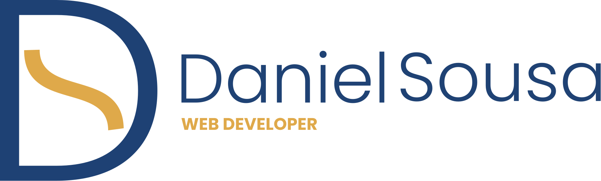

<h1 style="font-weight: 300">Useful Links</h1>

-   [UI & UX](#ui---ux)
-   [Image(s)](#image-s-)
    -   [Remove Background](#remove-background)
    -   [PNG Images](#png-images)
    -   [Bank Images](#bank-images)
-   [Icons](#icons)

<h2 style="font-weight: 300">UI & UX</h2>

Links related with **UI & UX** and tools, like **Adobe XD**, **Figma**, ...

-   [UI Sources](https://www.uisources.com/home)
-   [Design Resources](https://designresources.io/)
-   [UI Hut](https://uihut.com)
-   [XD File](https://xdfile.com)
-   [Freebie Supply](https://freebiesupply.com)
    -   **Note:** on this link you can found other files (like Photoshop, PowerPoint templates and more)
-   [XD Guru](https://www.xdguru.com)
-   [UI Sources](https://www.uisources.com)
-   [UI Store](https://www.uistore.design)

 
<h2 style="font-weight: 300">Image(s)</h2>

<h3 style="font-weight: 300; font-size: 1.25rem">Remove Background</h3>

-   [removebg](https://www.remove.bg/)
-   [Adobe Remove Background](https://www.adobe.com/express/feature/image/remove-background)
-   [removal.ai](https://removal.ai)
-   [Clipping Magic](https://clippingmagic.com)

<h3 style="font-weight: 300; font-size: 1.25rem">PNG Images</h3>

-   [PNGPix](http://www.pngpix.com)
-   [PNGImg](https://pngimg.com)
-   [Free PNG Img](https://freepngimg.com)
-   [PNGTree](https://pngtree.com)
-   [Stick PNG](http://www.stickpng.com)

<h3 style="font-weight: 300; font-size: 1.25rem">Bank Images</h3>

-   [Unsplash](https://unsplash.com)
-   [Pexels](http://pexels.com)
-   [Pixabay](https://pixabay.com)
-   [VisualHunt](https://visualhunt.com)
-   [Picography](https://picography.co)
-   [ISORepublic](https://isorepublic.com)
-   [StockSnap](https://stocksnap.io)
-   [FoodiesFeed](https://www.foodiesfeed.com)

 
<h2 style="font-weight: 300">Icons</h2>

SVG & Font icons

-   [Feather Icons](https://feather.netlify.app/)
-   [Eva Icons](https://akveo.github.io/eva-icons/)
-   [IonIcons](https://ionic.io/ionicons)
-   [Iconscout](https://iconscout.com/)
-   [CSS.gg](https://css.gg/app)
-   [Icon Store](https://iconstore.co/)
-   [Icon Monstr](https://iconmonstr.com/)
-   [Shape](https://shape.so/browse)

 
<h2 style="font-weight: 300">Code</h2>
